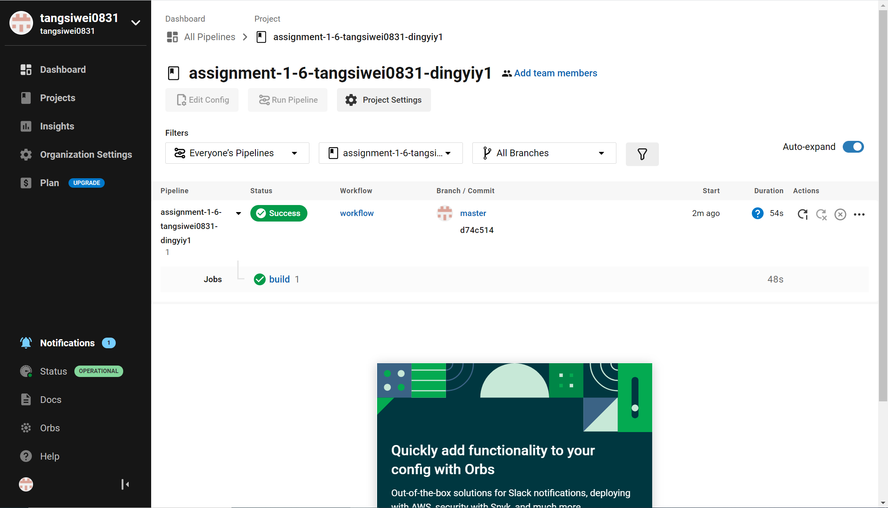
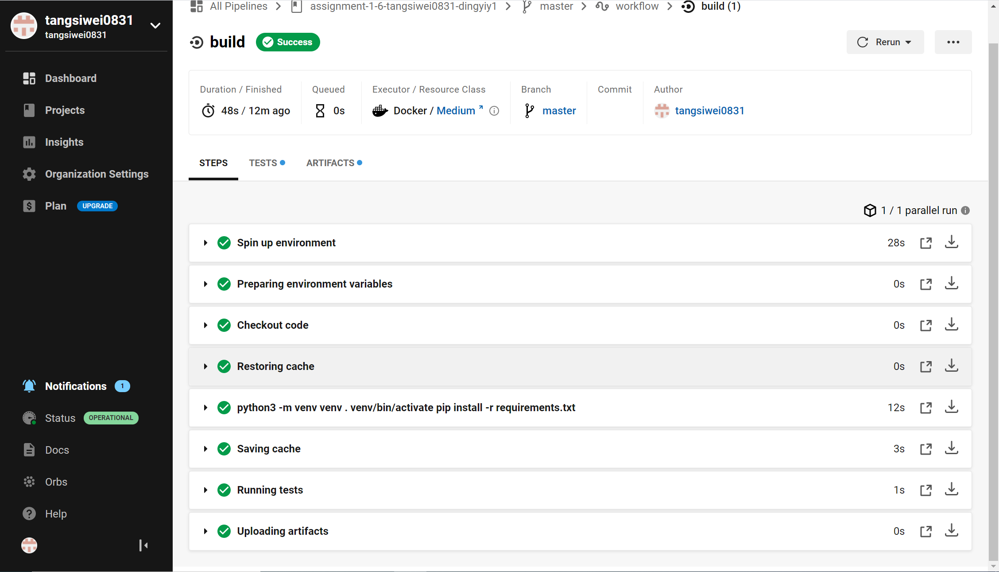
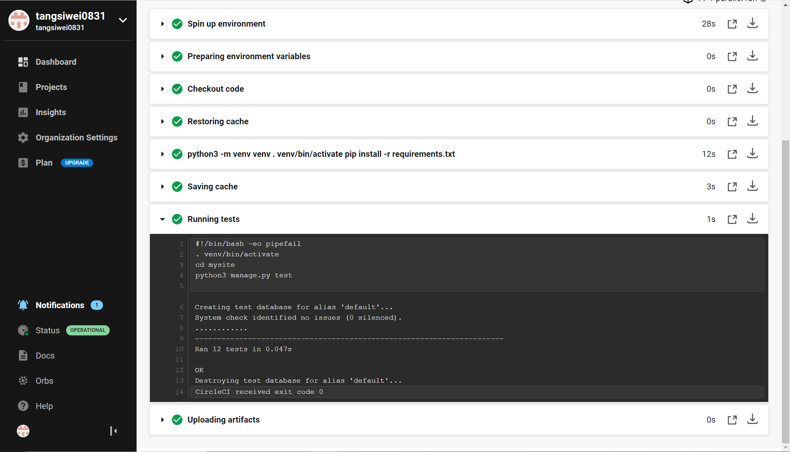
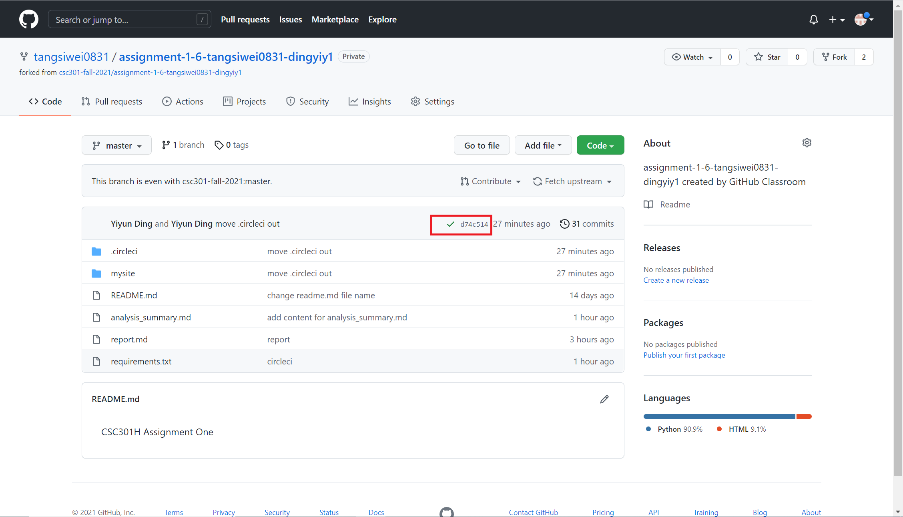

# Mobile/Web Option
our option is to make a web application.

# Options to choose for each component and considerations.

## backend
Node.js, Python, Go, Ruby is considered.

1. Python is a high level language, thus is easy to read and write. We both have experiences in using Python before.
2. Python is a very popular and powerful language. It has extensive open source libraries that can do almost everything, such as machine learning, web service tools, string operations, etc. Therefore, if we want to extend the applications to include more features or perform analysis, it will be very easy. 
3. Python can be easily integrated with other languages (eg. Java, C), thus it is a safe choice at the start of building an application as it is convenient if there are needs for other languages to involve.
4. Python's disadvantage would be its processing speed.
5. Node.js is also easy to learn and is very ideal to deal with real-time web applications. It does asynchronous request handling and thus it processes requests faster and does cucurrent processing. Therefore, it is better for data intensive applications, such as chat, video conference, etc. However, its asynchronous nature will result in so-called 'callback hell' issue, which means call backs might nested in other call backs several levels of deep. Therefore, it does not have good clean code standards, and thus not very suitable for larger projects.
6. The biggest advantage of Go compared with Python is that it supports concurrency and is more focused on system programming. The disadvantage is that it does not support object oriented programming and exceptions. Also, it does not have sufficient library support for future application extensions.
7. Ruby is an open source language with simple syntax designed for web development. It is helpful for developers to develop web application with different sized in a shorter time. However, it is more difficult to debug and is less popular compared with Python. And thus the community support and libraries are very limited. 
   
We both have experiences in Python before, and we want our applications to have the extension potential, easy to build and have sufficient community support. Also, since this application is pretty small now, its processing speed is not a big issue. Also, with Python's good integration ability, Python is finally chosen.

## python web development framworks
Three python web development frameworks are considered, which are Django, Pyramid, Flask.

1. Flask is a microframework for small applications and simple requirements, whereas Pyramid and Django are for larger applications. Therefore, Flask has a better performance than Pyramid and Django and responds faster.
2. Django requires less learning time to start developing but is not flexible as it involves many built in, such as templates, code structures, routing, authentications, database administration, etc. While Flask and Pyramid provides developers with more flexibility.
3. Django has the largest community among the three frameworks, thus there are more technical support for it.
4. Django is easier to extend and scale, and applies good design patterns.

We want out applications to have the extension potential. Therefore, Flask, as a microframwork, might not be sufficient. Choosing from Django and Pyramid, Django is easier to start with (don't need extra libraries or plug ins), Django is finally chosen.

## frontend
HTML and CSS
CSS - change our font and beautify the page

## database
relational database

## CI/CD
use Django.TestCase to write testcases
We use Circleci as our CI/CD tool to automate test cases.
Below is our result.

